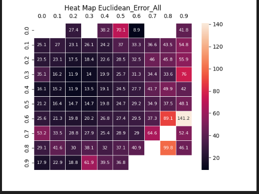
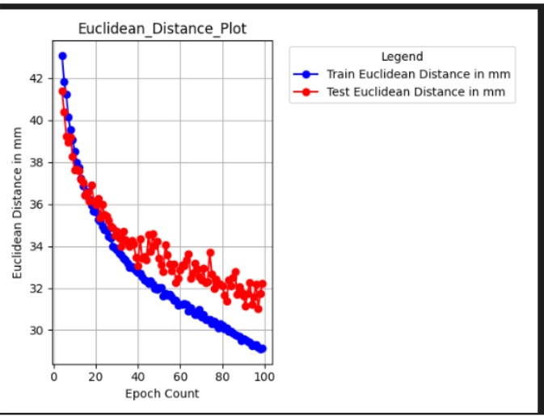

# Webcam Eye tracking with Deep Learning

## Introduction
This project provides deep learning models and training framework including the pytorch implementation of [Geddnet](https://github.com/czk32611/GEDDnet), for webcam eye tracking. 
This was done as a part of my work at [Semanux](https://semanux.com/).

## Environment
This is tested to work on Ubuntu 22.04 LTS, Pytorch 1.10.1 and CUDA driver version 11.3, but should work in any OS.
`pip install -r requirements.txt`

## Dataset Preperation 

The input  consists of (face, left eye, right eye, gaze cooordinates)
### Face

### RIght eye

### Left eye

These patches can be cropped from the dataset using facial landmarks, and the gaze coordinates can be obtained by
parsing the dataset, due to propriterary reasons we cannot release details yet. But some hints and tips are coming soon...

## Model Training
If you wish change the hyperparameters such as epochs or learning rate, it can be done so in the file 
[hyperparams.json](https://github.com/codeastra2/Webcam_Eyetracking/blob/main/model_training/webcam_eyetracking/model_training_config/hyperparams.json).
Run the following commands to train the model, with a GPU it should take ~45 mins for 30 epochs of training. 

- `cd model_training`
- `python -m  webcam_eyetracking.train_model`

## Inference

The results of the train/test can be found in the `reports` folder. Here you can find various metrics such as loss curves, metric curves heatmaps representing the general prediction and error distribution. 

### Error distrubution on the screen

### Euclidean error distance(in mm)

Our well trained model can predict with an error of +- 3 cm. 

## Live Demo

Coming soon.... 

## References

- Chen, Zhaokang, and Bertram Shi. “Towards High Performance Low Complexity Calibration in Appearance Based Gaze Estimation.” IEEE Transactions on Pattern Analysis and Machine Intelligence, 2022, pp. 1–1. Crossref, https://doi.org/10.1109/tpami.2022.3148386.

